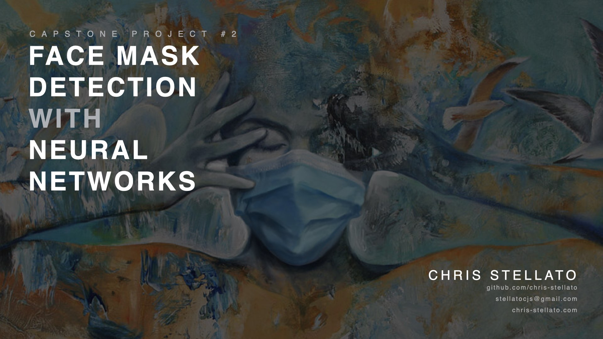
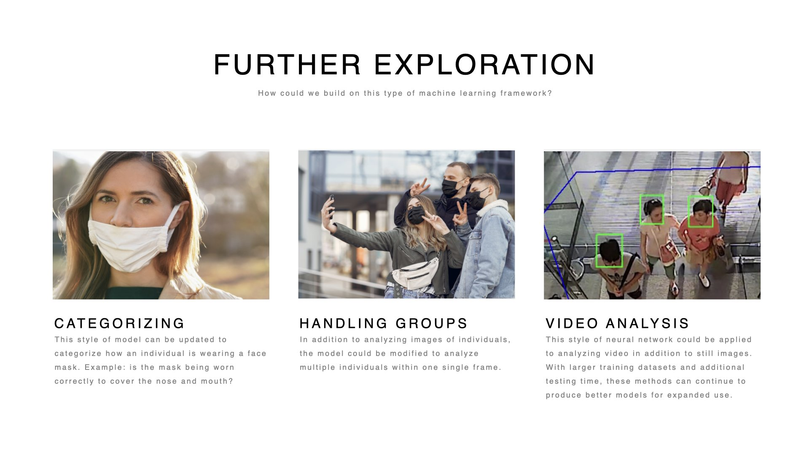

# Chris Stellato - Capstone 2 project
#
### Presentation 

The final project presentation includes a detailed description of product workflow, results of model training, validation, evaluation on holdout data, and a summary of insights and takeaways. View the final project presentation: https://github.com/chris-stellato/capstone2/blob/main/Presentation_Face_Mask_Image_Classification_Capstone_2_Project.pdf

#

#
## Daily project updates (5-day project)

#### Monday: 
- read in image data
- subset data for EDA
- EDA: manual image processing and transformation (grayscale, sobel)
- Vectorize
- create randomforest model
- fit, predict, score rf model w/ simple parameters on small dataset
- fit, predict, score rf model w/ larger dataset (images 224x224)
- create, fit, predict, score GradientBoostingClassifier model w/ full dataset (images 224x224)
- Create keras image generator

#### Tuesday: 
- Create keras Sequential() model, fit, train, test, tune learning rate
- create, train, predict and evaluate modified vgg16-based sequential model

#### Wednesday: 
- tune # trainable paramteters in vgg16 based model 
- write helper functions to set up images folder structure and divide images for train-valid-test splits
- create, train, predict new model and save
  - 18 epochs, 3M trainable parameters, loss: 0.0323 - accuracy: 0.9830  (could use ~15 epochs)
- writing code to run predictions on new samples not in the original tvt split
- begin presentation outline
- clean up code and work on turning notebook code into functions

#### Thursday: 
- Clean up all notebook codes, re-run all models on current image set and update performance metrics
- create graphs of model performance, confusion matricies, and performance over epochs graphs
- Finish presentation and fill in updated performance metrics
- re-tune long-run model and prepare for final long-run this evening

#### Friday:
- set up model on google collab and manually gridsearch many parameters
- generate new graphs and add to presentation
- write function for predicting on new batches of photos
- set up quick demo method using mac screenshot function
- reorganize git and publish clean commit without large files
